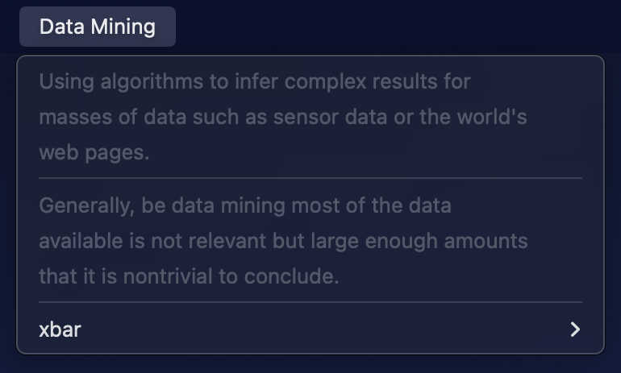
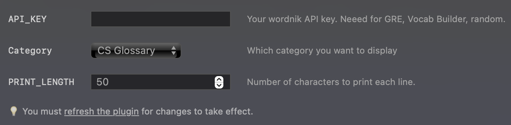

# Leetcode Reminder for xbar



## Overview

The "Leetcode Reminder" xbar script is designed to motivate and remind you to complete your daily coding challenge on Leetcode. By displaying a countdown to the next day's challenge directly on your menu bar, it serves as a constant reminder and encourages you to stay on track with your daily coding goals. The script is convenient, as this information is always visible on your screen, making it easier to stay focused and committed to your coding practice.

## Features

- Daily challenge details with links
- Weekly challenge details (for premium users)
- Countdown to the next day
- Streak count
- LeetCoin count
- Usable time travel tickets
- Check-in status
- Easter egg collection status

## Configuration

Before using the script, make sure to configure the following variables by either:
- Filling them in the xbar plugin browser if it's used with xbar

- Or filling them manually if it's used alone 
   ```python
   USERNAME = ""
   LEETCODE_SESSION = ""
   CSRFTOKEN = ""
   ```

## Variables
- `USERNAME`: Your leetcode username. Your homepage should be at `https://leetcode.com/<USERNAME>/`
- `LEETCODE_SESSION` and `CSRFTOKEN`: Go to `leetcode.com` and inspect the network tab. In the Request headers section, you will find two keys `csrftoken` and `LEETCODE_SESSION`. You should copy these values (without the `=` or `;`) into the script. 

## Requirements
- Python 3
- Dependencies: requests

## Installation
1. Make the script executable:
   ```
   chmod +x leetcode_reminder.py
   ```
2. Add the script to your xbar plugins directory.

## Usage
Run the script, and it will display the Leetcode information in your menu bar. Clicking on the displayed information will open relevant links, such as the Leetcode homepage and your daily challenge.

## References
1. [Leetcode GraphQL API](https://leetcode.com/graphql/)
2. [Leetcode GraphQL Queries](https://github.com/akarsh1995/leetcode-graphql-queries)
3. [xbar - The BitBar Replacement](https://xbarapp.com/)